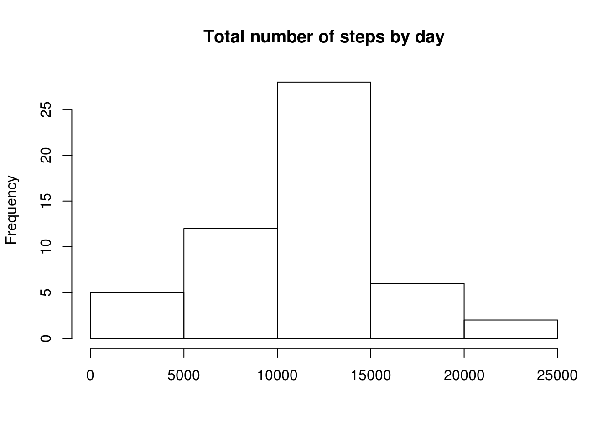
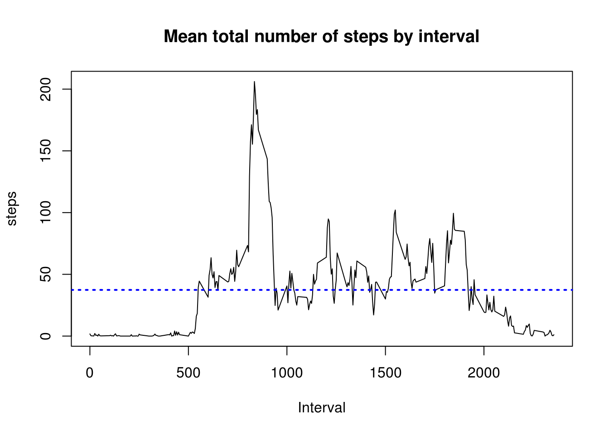
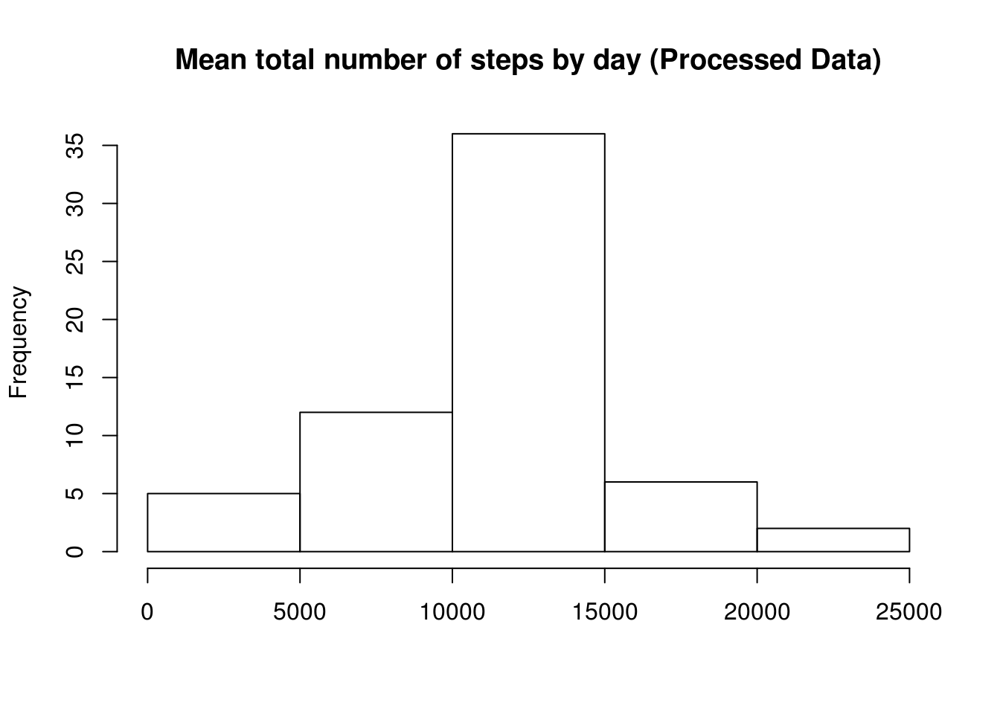
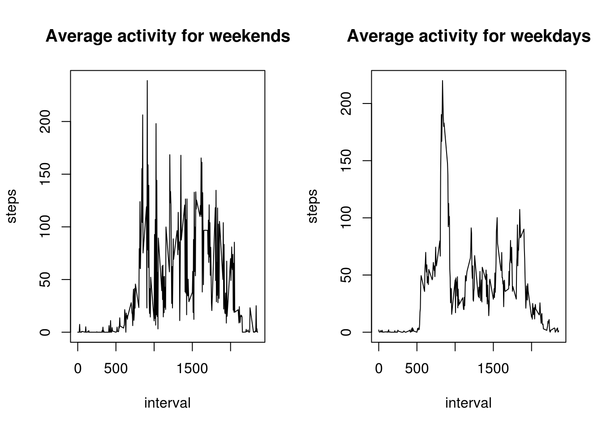

# Reproducible Research: Peer Assessment 1
Juan Pedro Vasquez  
July 18, 2015  

## Loading and preprocessing the data
1. Unzips the raw data file and loads the csv file into R

```r
unzip("activity.zip") #unzips raw data file
rawData <- read.csv("activity.csv")  #loads csv
dim(rawData)
```

```
## [1] 17568     3
```

```r
head(rawData)
```

```
##   steps       date interval
## 1    NA 2012-10-01        0
## 2    NA 2012-10-01        5
## 3    NA 2012-10-01       10
## 4    NA 2012-10-01       15
## 5    NA 2012-10-01       20
## 6    NA 2012-10-01       25
```

2. Avoids the NA values in *steps* column

```r
d <- rawData[complete.cases(rawData),] #avoids NA values
dim(d)
```

```
## [1] 15264     3
```

```r
head(d)
```

```
##     steps       date interval
## 289     0 2012-10-02        0
## 290     0 2012-10-02        5
## 291     0 2012-10-02       10
## 292     0 2012-10-02       15
## 293     0 2012-10-02       20
## 294     0 2012-10-02       25
```

## What is mean total number of steps taken per day?
1. An aggregation function is needed to sum up the steps taken each day.

```r
byDay <- aggregate(d$steps,list(day=d$date),sum) #summarizes by day
hist(byDay$x,main = "Total number of steps by day", xlab = "")
```

 

2. Mean and median total number of steps taken by day.

```r
meanStepsByDay <- mean(byDay$x)
medianStepsByDay <- median(byDay$x) 
meanStepsByDay
```

```
## [1] 10766.19
```

```r
medianStepsByDay
```

```
## [1] 10765
```


## What is the average daily activity pattern?
1. With a subtle change in the same aggregation function, now the steps may be summarized by intervals.

```r
byInterval <- aggregate(d$steps,list(interval=d$interval),mean) #summarizes by interval
```

The mean steps by interval is 

```r
meanSteps <- mean(byInterval$x) #mean steps by intervals 
meanSteps
```

```
## [1] 37.3826
```
Thus it can be plotted like this.

```r
plot(byInterval$interval,byInterval$x,type = "l", ylab = "steps", xlab = "Interval", main="Mean total number of steps by interval") #line plot
abline(meanSteps,0,lwd=2,col="blue",lty=3) #highlights such mean
```

 

2. The 5-minute interval with maximum number of steps is

```r
maxbyInterval <- byInterval[byInterval$x==max(byInterval$x),1]
maxbyInterval
```

```
## [1] 835
```

## Imputing missing values
1. There are some NA values in raw data in *steps* column. The number of rows with missing values is:

```r
dNa <- rawData[is.na(rawData$steps), ] #consider only NA values
rowsMissingValues <- dim(dNa)[1] #number of rows with NA values
rowsMissingValues
```

```
## [1] 2304
```

2. So those NA values may be replaced with the mean steps of each correspondent interval.

+ Taking the mean steps by interval

+ Merging it with the correspondent NA value steps

+ Reordering and renaming the columns


```r
byIntervalMean <- aggregate(d$steps,list(interval=d$interval),mean) 
dNaSolved <- merge(dNa,byIntervalMean,by = "interval")[,c(4,3,1)]
names(dNaSolved) <- c("steps", "date", "interval")
head(dNaSolved)
```

```
##      steps       date interval
## 1 1.716981 2012-10-01        0
## 2 1.716981 2012-11-30        0
## 3 1.716981 2012-11-04        0
## 4 1.716981 2012-11-09        0
## 5 1.716981 2012-11-14        0
## 6 1.716981 2012-11-10        0
```

3. Creates a new dataset that is equal to the original dataset but with the
missing data filled in.

```r
processedData <- rbind(d,dNaSolved)
dim(processedData)
```

```
## [1] 17568     3
```

4. Taking again the total number of steps by day, but now with these processed data.

```r
byDayProcessed <- aggregate(processedData$steps,list(day=processedData$date),sum) #summarizes by day
hist(byDayProcessed$x,main = "Mean total number of steps by day (Processed Data)", xlab = "")
```

 

5. Mean and median of total number of steps by day (processed data)

```r
meanStepsByDayProcessed <- mean(byDayProcessed$x)
medianStepsByDayProcessed <- median(byDayProcessed$x) 
meanStepsByDayProcessed
```

```
## [1] 10766.19
```

```r
medianStepsByDayProcessed
```

```
## [1] 10766.19
```

As can be seen, there is not a big change in results when the missing values are taken in count. The histogram is very similar and also are the mean and median.


## Are there differences in activity patterns between weekdays and weekends?
1. Identifying weekdays

```r
wkdys <- as.factor(weekdays(as.Date(processedData$date)))
fullprocessed <- cbind(processedData, wkdys)
head(fullprocessed)
```

```
##     steps       date interval   wkdys
## 289     0 2012-10-02        0 Tuesday
## 290     0 2012-10-02        5 Tuesday
## 291     0 2012-10-02       10 Tuesday
## 292     0 2012-10-02       15 Tuesday
## 293     0 2012-10-02       20 Tuesday
## 294     0 2012-10-02       25 Tuesday
```

2. Separating the processed data in weekdays and weekends

```r
fullProcWeekEnd <- fullprocessed[wkdys==c("Saturday","Sunday"),]
dim(fullProcWeekEnd)
```

```
## [1] 2359    4
```

```r
fullProcWeekDay <- fullprocessed[wkdys!=c("Saturday","Sunday"),]
dim(fullProcWeekDay)
```

```
## [1] 15209     4
```

3. Plotting mean activity for weekends

```r
byIntervalMeanFullProcessedWkEnd <- aggregate(fullProcWeekEnd$steps, list(interval=fullProcWeekEnd$interval),mean)
```

4. Plotting mean activity for weekdays

```r
byIntervalMeanFullProcessedWkDay <- aggregate(fullProcWeekDay$steps, list(interval=fullProcWeekDay$interval),mean)
###
par(mfrow=c(1,2))
plot(byIntervalMeanFullProcessedWkEnd$interval, byIntervalMeanFullProcessedWkEnd$x, type = "l", ylab="steps", xlab = "interval", main="Average activity for weekends")
plot(byIntervalMeanFullProcessedWkDay$interval, byIntervalMeanFullProcessedWkDay$x, type = "l", ylab="steps", xlab = "interval", main="Average activity for weekdays")
```

 


